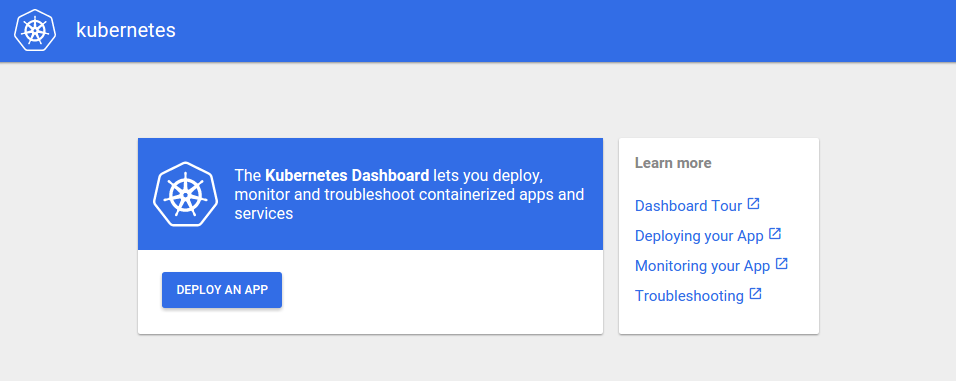
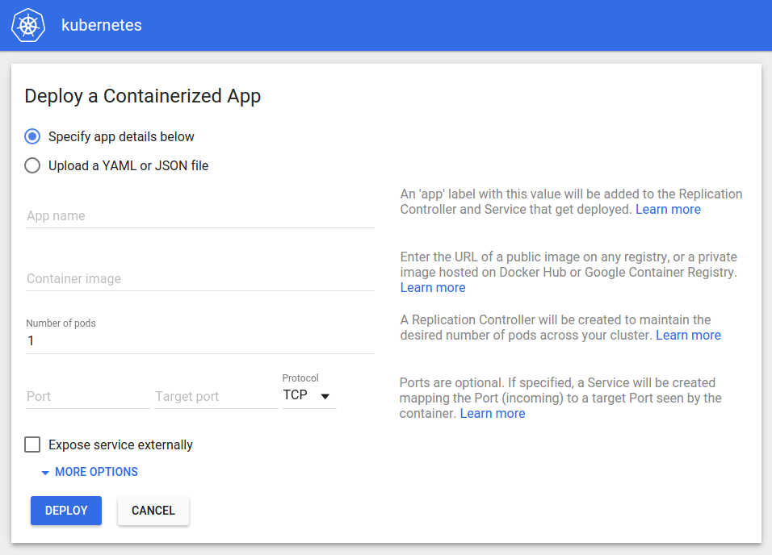
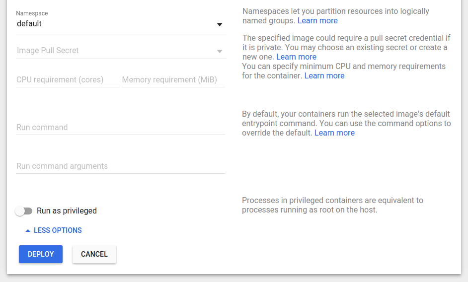
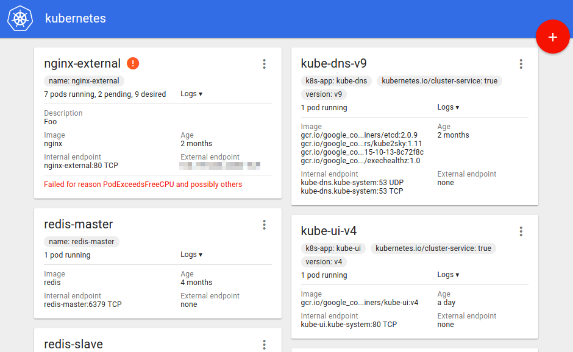
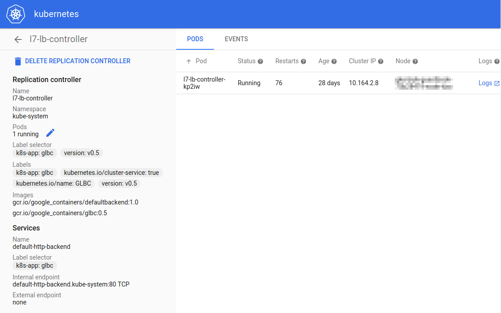

<!-- BEGIN MUNGE: UNVERSIONED_WARNING -->

<!-- BEGIN STRIP_FOR_RELEASE -->


<h2>PLEASE NOTE: This document applies to the HEAD of the source tree</h2>

If you are using a released version of Kubernetes, you should
refer to the docs that go with that version.

<!-- TAG RELEASE_LINK, added by the munger automatically -->
<strong>
The latest release of this document can be found
[here](http://releases.k8s.io/release-1.1/docs/user-guide/ui.md).

Documentation for other releases can be found at
[releases.k8s.io](http://releases.k8s.io).
</strong>
--

<!-- END STRIP_FOR_RELEASE -->

<!-- END MUNGE: UNVERSIONED_WARNING -->

# Kubernetes Dashboard User Interface

Kubernetes has a web-based user interface that allows users to manage applications running in
the cluster, troubleshoot them, as well as manage the cluster itself.

## Accessing the Dashboard

By default, the Kubernetes Dashboard is deployed as a cluster addon. To access it, visit
`https://<kubernetes-master>/ui`, which redirects to
`https://<kubernetes-master>/api/v1/proxy/namespaces/kube-system/services/kubernetes-dashboard`.

If you find that you're not able to access the Dashboard, it may be because the kubernetes-dashboard
service has not been started on your cluster. In that case, you can start it manually with:

```sh
kubectl create -f cluster/addons/dashboard/dashboard-controller.yaml --namespace=kube-system
kubectl create -f cluster/addons/dashboard/dashboard-service.yaml --namespace=kube-system
```

Normally, this should be taken care of automatically by the
[`kube-addons.sh`](http://releases.k8s.io/HEAD/cluster/saltbase/salt/kube-addons/kube-addons.sh)
script that runs on the master. Release notes and development versions of the Dashboard can be
found at https://github.com/kubernetes/dashboard/releases.

## Overview

The Dashboard can be used to introspect a cluster, such as show applications running on the
cluster, or surface problems in in the state of services. You can also use the UI to modify
your cluster. For example, you can deploy applications or change their number of replicas.

### Using the Dashboard

When the accessed Dashboard works on an empty cluster, it shows welcome page with links to user
guide and documentation. It also allows to deploy to the cluster your first application.


### Deploying applications

With Dashboard you can deploy a replicated application using a simple form that guides through all
required steps. All that is needed is a container image URI
(e.g., on Google Container Registry or Docker Hub) and knowledge on what ports the image exposes.
A replicated application that is deployed through the form is a replication controller plus optional
service (if port mappings are specified).



The application deploy form has more options view where advanced configuration settings for the
deployed application can be changed, e.g., namespace or image pull secret.



#### Applications view

Main Dashboard view shows all applications that are running in the cluster. Applications are
denoted by cards that represent a replication controller plus zero or more services. Cards show
overview information of applications and allow for simple modifications (e.g., edit replica count)
and logs viewing. If error state is detected for a card, it is surfaced to the user.



The application details page lists all replicas together with basic information about them.
The events page displays events that are related to replicas of the application.



## More Information

For more information, see the
[Kubernetes Dashboard repository](https://github.com/kubernetes/dashboard).

<!-- BEGIN MUNGE: GENERATED_ANALYTICS -->
[]()
<!-- END MUNGE: GENERATED_ANALYTICS -->
